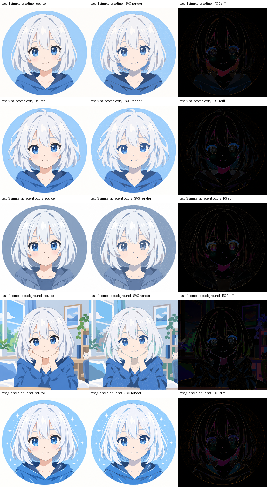

# LayerTrace

LayerTrace is a proof of concept for approximating opaque, flat-color raster
illustrations as editable SVG. It does **not** reconstruct a watertight planar
subdivision. Instead, it builds a paint stack and draws large back layers before
small front layers. Lower shapes may extend slightly underneath later shapes so
minor contour and simplification errors do not reveal cracks.

> ラスタ画像を watertight な面分割へ復元するのではなく、奥から手前への
> 重ね描画によって SVG として近似する PoC です。

> [!IMPORTANT]
> **Inspiration / Special Thanks**
>
> LayerTrace was inspired by Masaki Ozeki's
> **[ozekimasaki/raster-to-vector](https://github.com/ozekimasaki/raster-to-vector)**.
> このプロジェクトを始める着想を与えてくれた、重要なインスパイア元です。
> Please visit the original repository as well.

The current target is anime/illustration artwork with opaque flat colors or
cel-style shading and a modest palette. Photographs, transparency, gradients,
textures, semantic understanding, shared-edge reconstruction, topology solvers,
AI segmentation, and advanced Bézier fitting are intentionally out of scope.

**This project is an independent implementation.** No code is copied or ported
from `raster-to-vector`.

## Results on five illustrations

The repository includes five 1254×1254 regression images covering a simple
portrait, more complex hair, similar adjacent colors, a complex room
background, and fine highlights. The results below use 32 colors,
`simplify=1.0`, containment ordering, 1px underlap, cubic fitting, and safe
consecutive path batching.



| Test | Focus | MAE | Regions | SVG paths | Vertices |
|---|---|---:|---:|---:|---:|
| test_1 | simple baseline | 3.910 | 45,861 | 5,398 | 308,298 |
| test_2 | hair complexity | 3.622 | 44,595 | 5,413 | 314,642 |
| test_3 | similar adjacent colors | 3.606 | 39,668 | 5,058 | 280,308 |
| test_4 | complex background | 7.711 | 15,272 | 3,570 | 135,044 |
| test_5 | fine highlights | 4.105 | 41,668 | 5,267 | 288,291 |

These are PoC results rather than claims of exact reconstruction. Source files
are in `examples/test_pic`; the evaluation and batching reports contain the
full conditions and limitations.

## Install and run

Python 3.10 or newer is required.

```console
python -m pip install -e ".[test]"
python -m layertrace input.png --colors 32 --underlap 1 --simplify 1.0 --ordering containment --curve-fit cubic --curve-error 1.0 --path-batching consecutive --output ./out
```

The output directory contains:

- `source.png`, `quantized.png`, and a `regions.png` contour preview
- editable `output.svg`, its `rendered.png`, `diff.png`, and `metrics.json`
- `run.json`, including the explicit back-to-front region ID list
- `comparisons/underlap_0` and `comparisons/underlap_N`, generated from the
  same regions and layer order

Useful controls are `--colors`, `--underlap`, `--simplify`, `--min-area`,
`--smoothing`, `--ordering {area,containment}`, `--curve-fit {off,cubic}`,
`--curve-error`, and `--path-batching {off,consecutive}`. The most common quantized
color is treated as the background for the background-exposure metric.

## Pipeline

1. optional Gaussian smoothing
2. Pillow median-cut color quantization
3. 8-connected component extraction per palette label
4. tiny-component merge into the most common touching color
5. OpenCV contour extraction and Douglas-Peucker simplification
6. explicit paint ordering: containment depth, then descending area
7. bounded morphological dilation of every non-frontmost lower layer
8. independent or safely batched compound even-odd SVG paths, rendered with CairoSVG
9. RGB diff and minimal metrics

`--ordering area` provides the simpler descending-area heuristic. Neither mode
constructs shared edges, a DCEL, junctions, or a planar subdivision.

## Metrics and interpretation

`metrics.json` records dimensions, actual quantized color count, region and SVG
shape counts, total vertices, mean/max RGB error, different-pixel ratio, and
`white_gap_pixel_count`. The last value uses the SVG render alpha channel to
count source foreground pixels where the white canvas remains exposed. It is a
useful PoC crack signal, not a semantic foreground metric.

Underlap trades cracks for possible color bleed. Compare both rendered images
and errors; a lower gap count alone does not establish higher visual quality.

## Demo and tests

Generate the included hand-authored flat illustration input and trace it:

```console
python examples/make_demo.py
python -m layertrace examples/demo_input.png --colors 16 --underlap 1 --simplify 1.5 --min-area 12 --smoothing 0.5 --output out/demo
python -m pytest -q
```

Focused tests cover rectangle regions, nesting/containment order, touching
regions, a small foreground detail, zero versus positive underlap, and SVG XML
validity/independent region paths.

## Five-image evaluation

The bounded Phase 2 runner executes the fixed 40-run matrix and writes
reproducibility metadata, CSV/JSON summaries, sweep grids, and best-condition
comparison grids:

```console
python -m layertrace.evaluate --input-dir examples/test_pic --output out/test-set-evaluation
```

The full observed report is in `EVALUATION_PHASE2.md`. This evaluation uses the
existing defaults for filtering and smoothing; it does not perform automatic
parameter optimization.

## Phase 3 efficiency benchmark

The optional cubic mode keeps short and corner-heavy contours as lines, and
fits only long smooth contours with recursively subdivided least-squares cubic
Béziers. A cubic is retained only when it is both shorter on disk and uses fewer
commands than its line fallback.

```console
python -m layertrace input.png --colors 32 --underlap 1 --simplify 1.0 --ordering containment --curve-fit cubic --curve-error 1.0 --output ./out
python -m layertrace.phase3 --output out/phase3-efficiency
```

Metrics now distinguish shapes, on-curve vertices, path commands, line and
cubic commands, cubic control points, contours, and SVG bytes. The complete
benchmark and its limitations are documented in `EVALUATION_PHASE3.md`.

## Phase 4 paint-equivalent batching

Consecutive regions are eligible for one compound path only when fill, stroke,
opacity, fill rule, and transform state match. Batches are split when painted
bounding boxes plus an antialias safety margin intersect, preventing `evenodd`
subpaths from cancelling overlapping underlap geometry. Region geometry and
paint order are serialized unchanged.

```console
python -m layertrace input.png --colors 32 --underlap 1 --simplify 1.0 --ordering containment --curve-fit cubic --curve-error 1.0 --path-batching consecutive --output ./out
python -m layertrace.phase4 --output out/phase4-batching
```

See `EVALUATION_PHASE4.md` for the baseline/batched render comparison and batch
size distribution.

## License

GPL-3.0-only. See `LICENSE`.
